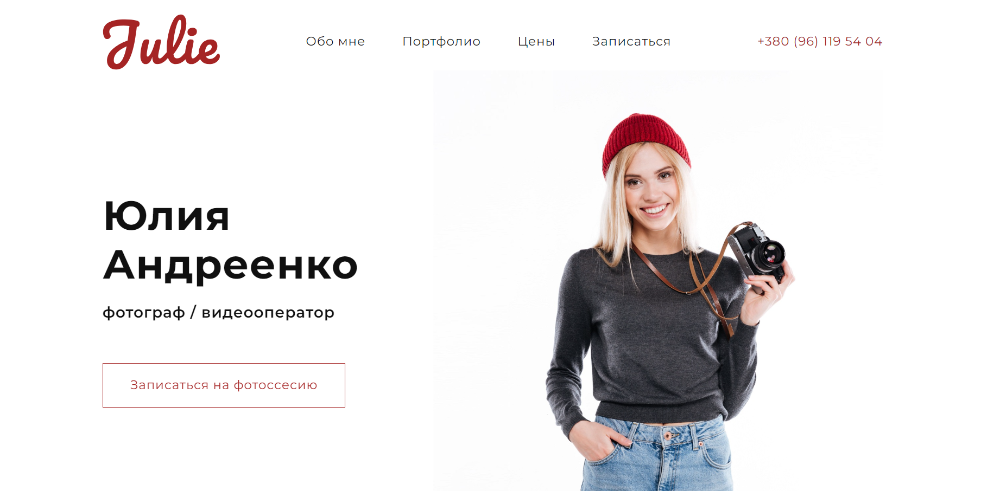
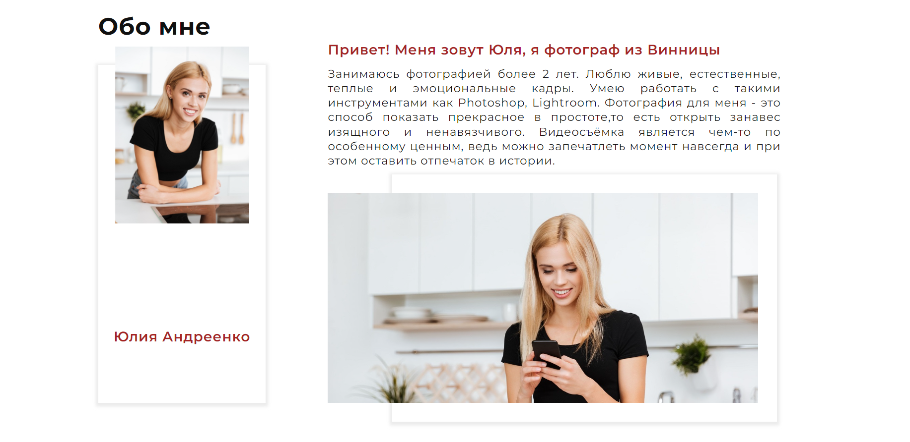
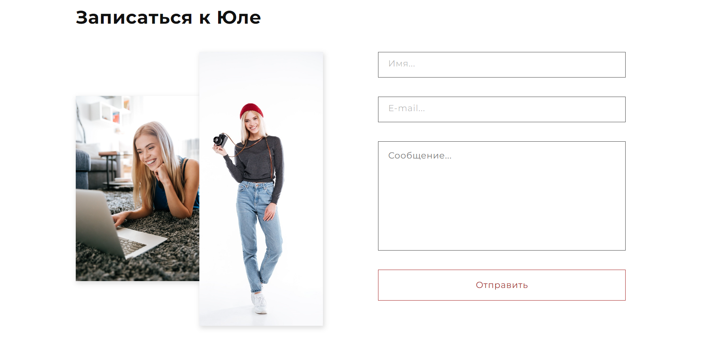

# Photograph Portfolio

This simple landing page is designed to showcase the photographer's portfolio and provide information about the services. It is built using HTML and CSS, and the page is fully responsive. It utilizes anchor links for smooth navigation.

## Features

- Fully responsive and adaptive design.
- Smooth scrolling navigation with anchor links.
- Use of CSS variables for easy theming.
- Use of Animate.css/Josh.js libraries to add animations to some elements for interactive experience.

## Tech Stack

- HTML
- CSS (with CSS variables)
- Animate.css/Josh.js

## Access the App

You can access the application at the following link: [Photograph Portfolio](https://nataly-horbunova.github.io/photograph_portfolio/)

## Screenshots

_Home_

_About_

_Contacts_

## Getting Started

git clone https://github.com/Nataly-Horbunova/photograph_portfolio.git

cd photograph_portfolio
